<h1 align="center">Привет, Кирилл
</h1>
<h2 align="center">Это гайд по запуску и работе с проектом для тебя</h2>

## Запуск
После того, как ты скачал репозиторий, заходим в папку и запускаем файл с расширением .sln:

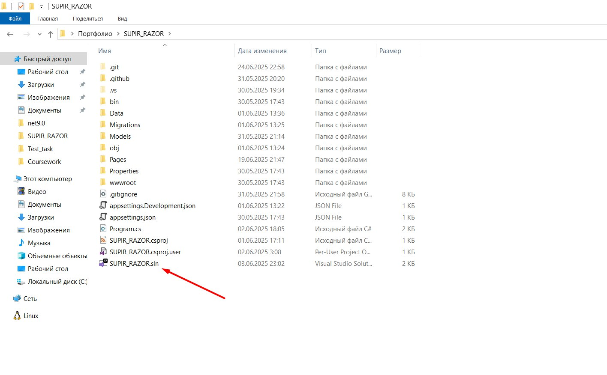
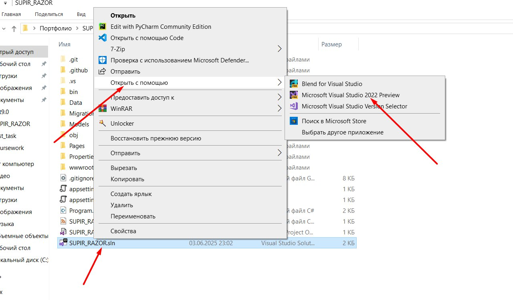

## Структура проекта
Разберём структуру проекта


+ 1 - папка с html файлами
+ 2 - файл с лейаутом(шапка и подвал)
+ 3.1 Html файл страницы
+ 3.2 cs файл страницы. В нём лежит бекенд часть (HTTP запросы)
+ 4.1 & 4.2 то же, что и 3.1 & 3.2

___


В папке wwwroot лежат папки с файлами CSS и JS.

## Работа с Git
### При работе мы не сохраняем изменения в main. Нужно будет создавать отдельные ветки на отдельные задачи:

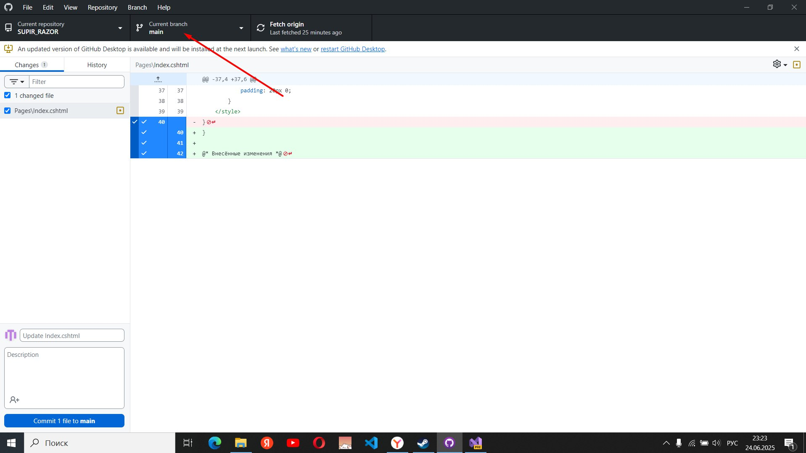
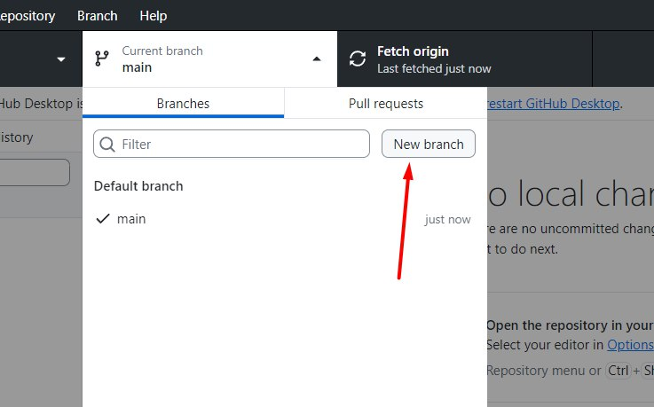
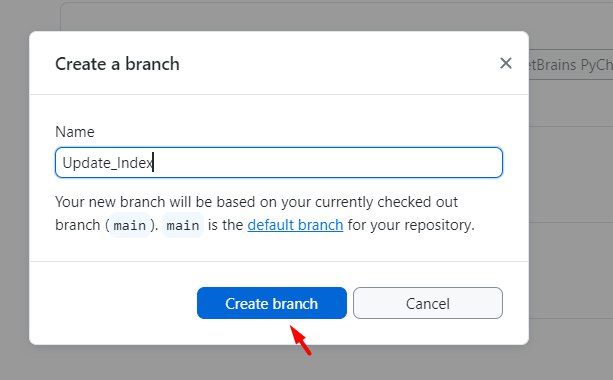
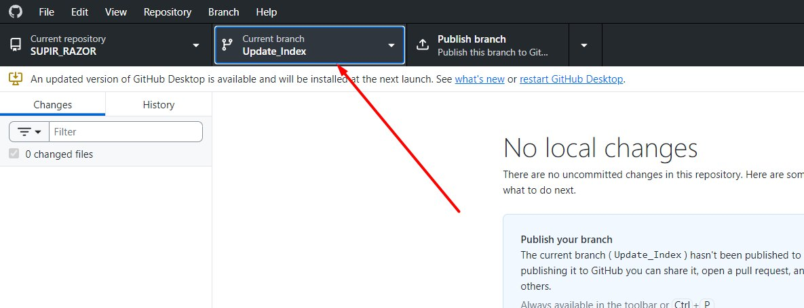

### Внесённые изменения отобразятся на страничке в GitHubDesktop:

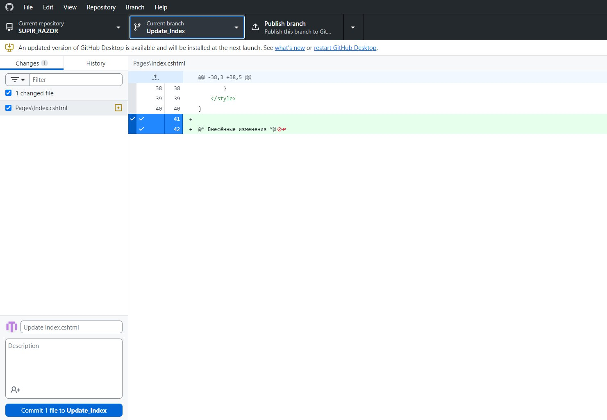
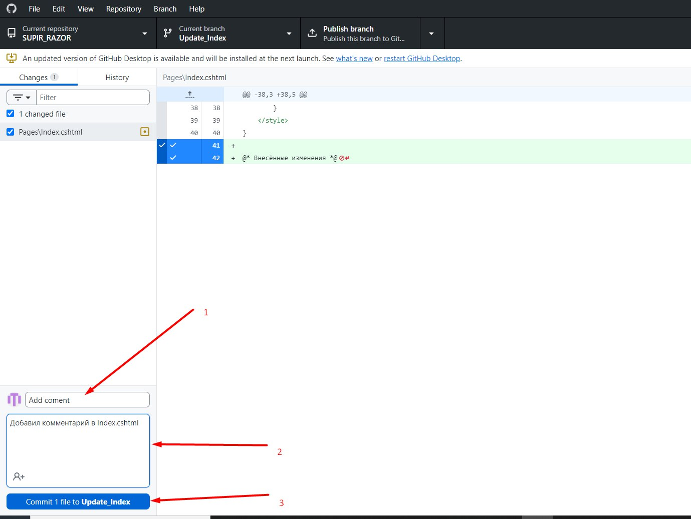

+ 1 - название коммита
+ 2 - описание коммита
+ 3 - кнопка создать коммит

### После, публикуем коммит

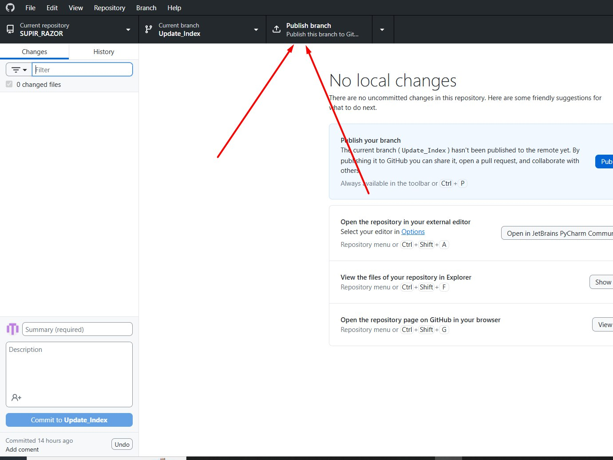

## Docker
### После скачивания обновляем докер если нужно и попадаем на данную страничку. (если нет смотри гайды. У меня в биосе была выключена поддержка контейнеров)

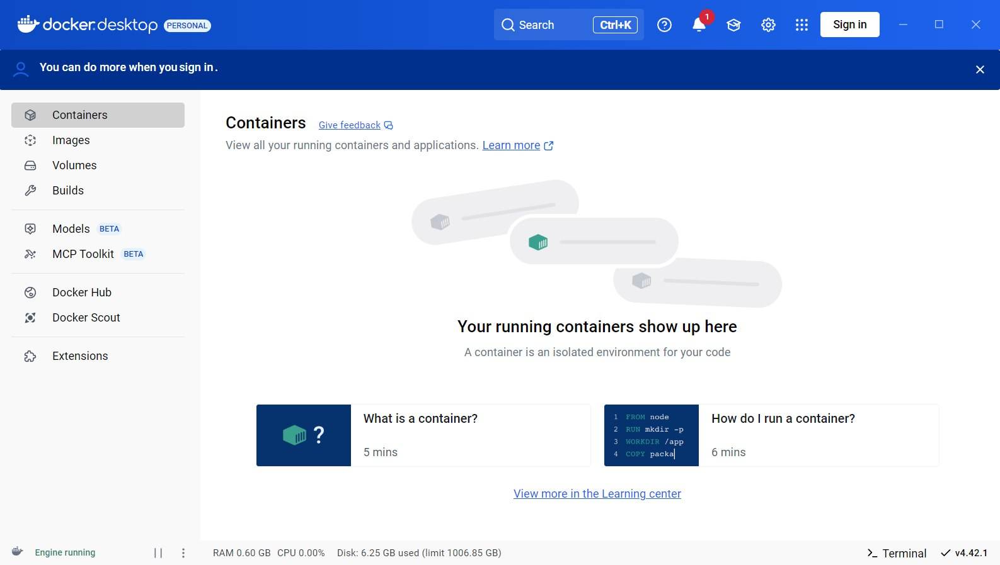

### Жмём `Win + R` и вводим powershell. Нажимаем ок.

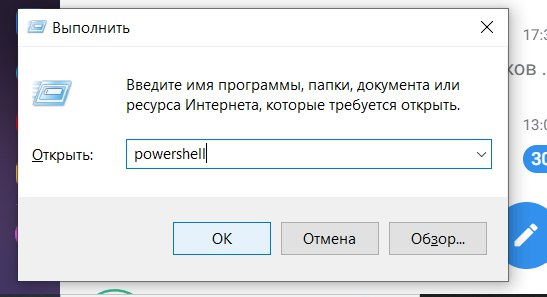

### Переходим в папку проекта и копируем путь (НЕ ВКЛЮЧАЯ С:)

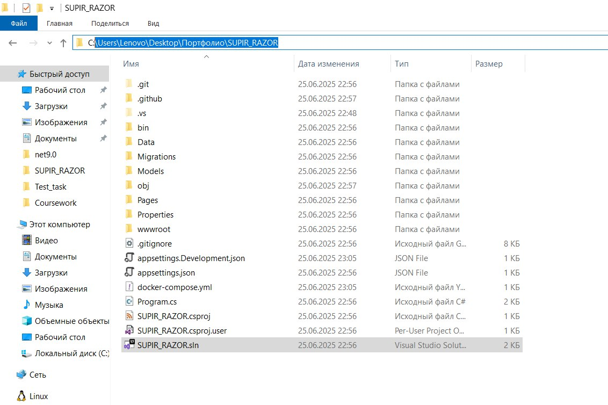

### переходим в папку:

### cd *ПУТЬ_К_ФАЙЛУ*

### (звёздочки не пишем)

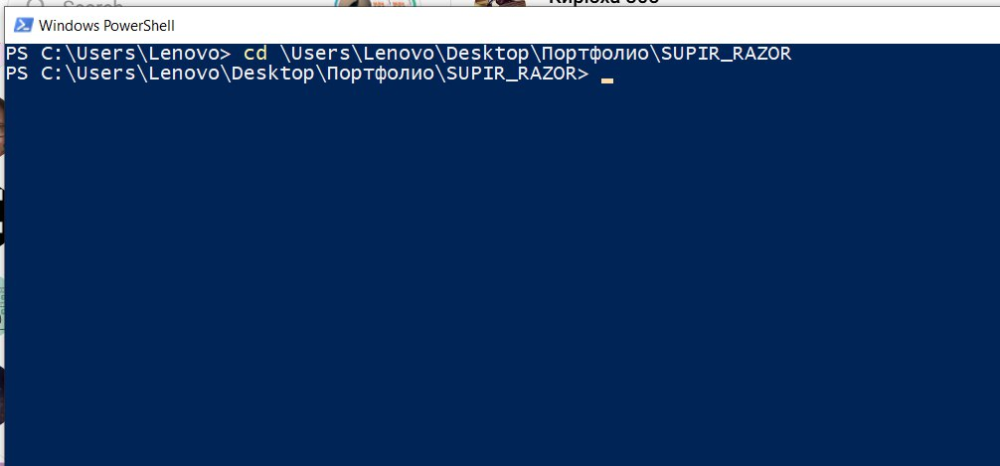

### запускаем докер контейнер:

```bash
docker-compose up -d
```
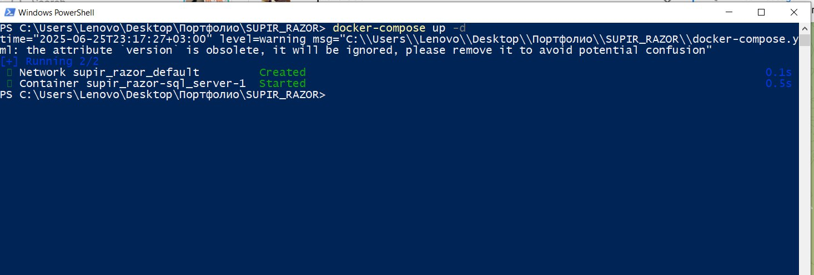

### Убедимся, что контейнер запущен и идём дальше:

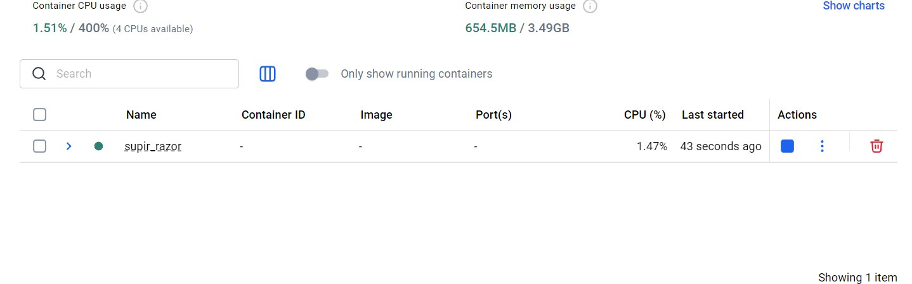

### Вводим следующие команды:

Установка EntityFramework
```bash
dotnet tool install --global dotnet-ef
```

Применяем миграции
```bash
dotnet ef database update
```

## Поздравляю. Проект готов к запуску. Нажимаем F5 и оцениваем результат
